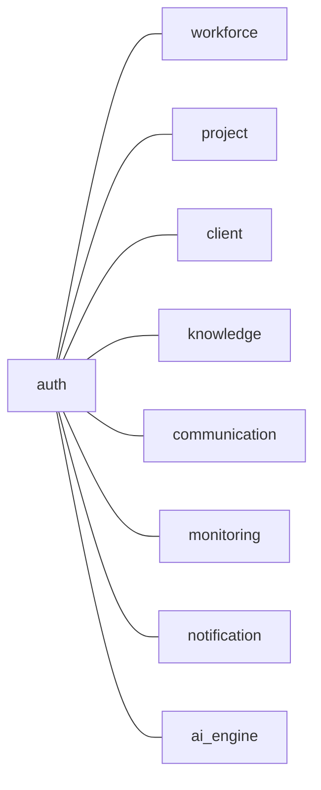

# Vistone Server

An AI-powered project management platform built as a microservices monorepo using **Nx**, **Express**, **Fastify**, **Prisma**, and **PostgreSQL**.

---

## Architecture Overview

```
┌─────────────────────────────────────────────────────────────┐
│                      API Gateway (:4000)                    │
│                  Apollo GraphQL + Express                   │
└──────────┬──────────┬──────────┬──────────┬────────────────┘
           │          │          │          │
     ┌─────▼──┐ ┌────▼───┐ ┌───▼────┐ ┌───▼──────────┐
     │  Auth  │ │Project │ │ Client │ │  Workforce   │
     │:3001   │ │ Mgmt   │ │  Mgmt  │ │    Mgmt      │
     │        │ │:3003   │ │:3004   │ │  :3002       │
     └────────┘ └────────┘ └────────┘ └──────────────┘
     ┌────────┐ ┌────────┐ ┌────────┐ ┌──────────────┐
     │Knowled.│ │ Comms  │ │Monitor.│ │ Notification │
     │  Hub   │ │:3006   │ │& Report│ │   :3008      │
     │:3005   │ │        │ │:3007   │ │              │
     └────────┘ └────────┘ └────────┘ └──────────────┘
     ┌────────────────────┐
     │    AI Engine       │
     │  Fastify + RAG     │
     │     :3009          │
     └────────────────────┘
```

## Microservices

| Service                                                         | Port   | Framework | DB Schema       | Description                              |
| --------------------------------------------------------------- | ------ | --------- | --------------- | ---------------------------------------- |
| [API Gateway](./apps/api-gateway/README.md)                     | `4000` | Express   | —               | GraphQL gateway aggregating all services |
| [Auth Service](./apps/auth-service/README.md)                   | `3001` | Express   | `auth`          | Authentication, users, orgs, roles       |
| [Workforce Management](./apps/workforce-management/README.md)   | `3002` | Express   | `workforce`     | Teams, members, skills, availability     |
| [Project Management](./apps/project-management/README.md)       | `3003` | Express   | `project`       | Projects, tasks, milestones, risks       |
| [Client Management](./apps/client-management/README.md)         | `3004` | Express   | `client`        | Clients, feedback, proposals             |
| [Knowledge Hub](./apps/knowledge-hub/README.md)                 | `3005` | Express   | `knowledge`     | Wiki, documents, folders, permissions    |
| [Communication](./apps/communication/README.md)                 | `3006` | Express   | `communication` | Chat channels, messages, mentions        |
| [Monitoring & Reporting](./apps/monitoring-reporting/README.md) | `3007` | Express   | `monitoring`    | KPIs, reports, dashboards, automation    |
| [Notification](./apps/notification/README.md)                   | `3008` | Express   | `notification`  | Notifications, templates, emails         |
| [AI Engine](./apps/ai-engine/README.md)                         | `3009` | Fastify   | `ai_engine`     | RAG pipeline, chat, agent, data sync     |

---

## Tech Stack

| Layer        | Technology                                        |
| ------------ | ------------------------------------------------- |
| Monorepo     | Nx 22                                             |
| Runtime      | Node.js + TypeScript 5.9                          |
| HTTP         | Express 5 (most services), Fastify 5 (AI Engine)  |
| API          | Apollo GraphQL (gateway), REST (microservices)    |
| Database     | PostgreSQL with Prisma ORM + `@prisma/adapter-pg` |
| Validation   | Zod 4                                             |
| AI / LLM     | LangChain + Mistral AI                            |
| Vector Store | pgvector (PostgreSQL extension)                   |
| Auth         | Google OAuth + token-based sessions               |
| Email        | Nodemailer                                        |
| Testing      | Jest 30 + Axios (E2E)                             |

---

## Getting Started

### Prerequisites

- Node.js ≥ 18
- PostgreSQL with `vector` extension enabled
- Google OAuth Client ID (for Google sign-in)

### 1. Clone & Install

```bash
git clone https://github.com/afnanahmadtariq/vistone-server.git
cd vistone-server
npm install
```

### 2. Configure Environment

```bash
cp .env.example .env
```

Edit `.env` with your PostgreSQL connection string and other credentials.

### 3. Initialize Database Schemas

Run the following SQL against your PostgreSQL instance:

```sql
CREATE SCHEMA IF NOT EXISTS auth;
CREATE SCHEMA IF NOT EXISTS workforce;
CREATE SCHEMA IF NOT EXISTS project;
CREATE SCHEMA IF NOT EXISTS client;
CREATE SCHEMA IF NOT EXISTS knowledge;
CREATE SCHEMA IF NOT EXISTS communication;
CREATE SCHEMA IF NOT EXISTS monitoring;
CREATE SCHEMA IF NOT EXISTS notification;
CREATE SCHEMA IF NOT EXISTS ai_engine;
```

### 4. Sync Database & Start Development

```bash
npm run dev
```

This command automatically:

- Pushes all Prisma schemas to the database
- Generates all Prisma clients
- Starts all 10 microservices in parallel

### 5. Seed Data (optional)

```bash
npm run seed
```

---

## Available Commands

| Command                   | Description                                        |
| ------------------------- | -------------------------------------------------- |
| `npm run dev`             | Sync DB + start all services (development)         |
| `npm run prod`            | Generate clients + start all services (production) |
| `npm run db:sync`         | Push schemas to DB + generate clients              |
| `npm run db:push`         | Push schemas to database only                      |
| `npm run prisma:generate` | Generate all Prisma clients                        |
| `npm run prisma:validate` | Validate all Prisma schemas                        |
| `npm run seed`            | Run seed script                                    |
| `npm run start:all`       | Start all services (no DB sync)                    |

### Individual Service Commands

```bash
# Serve a specific service
npx nx serve auth-service

# Run tests for a service
npx nx test project-management

# Run E2E tests
npx nx e2e project-management-e2e

# Generate Prisma client for a service
npx nx run @vistone-server/auth-service:prisma:generate
```

---

## Database Schemas Overview

Each microservice owns its own PostgreSQL schema to ensure data isolation:



For detailed schema documentation, see the individual service READMEs linked in the [Microservices](#microservices) table above.

---

## Project Structure

```
vistone-server/
├── apps/
│   ├── api-gateway/          # GraphQL API Gateway
│   ├── auth-service/         # Authentication & Users
│   ├── workforce-management/ # Teams & Workforce
│   ├── project-management/   # Projects & Tasks
│   ├── client-management/    # Client CRM
│   ├── knowledge-hub/        # Wiki & Documents
│   ├── communication/        # Chat & Messaging
│   ├── monitoring-reporting/  # KPIs & Dashboards
│   ├── notification/         # Notifications & Email
│   ├── ai-engine/            # AI/RAG Engine
│   └── *-e2e/                # E2E test projects
├── scripts/                  # DB sync & seed scripts
├── .env                      # Environment variables
├── nx.json                   # Nx workspace configuration
├── package.json              # Root dependencies & scripts
└── tsconfig.base.json        # Shared TypeScript config
```

---

## Production Notes

- **Database:** `db:push` is disabled in production — use proper migrations.
- **`npm run prod`** only generates Prisma clients, does **not** modify the database.
- Each service can be deployed independently as a container.
