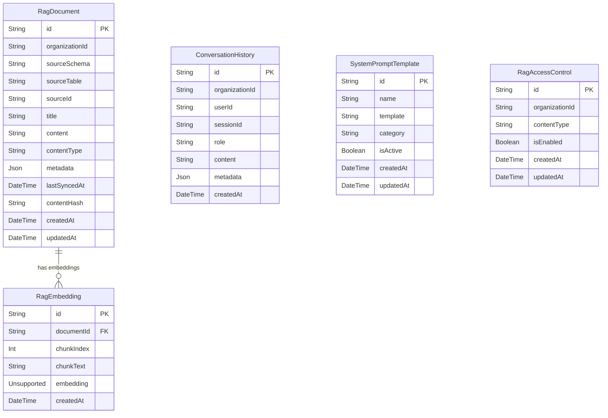

# AI Engine ERD

```mermaid
erDiagram
    RagDocument ||--o{ RagEmbedding : "has embeddings"
    RagDocument {
        String id PK
        String organizationId
        String sourceSchema
        String sourceTable
        String sourceId
        String title
        String content
        String contentType
        Json metadata
        DateTime lastSyncedAt
        String contentHash
        DateTime createdAt
        DateTime updatedAt
    }
    RagEmbedding {
        String id PK
        String documentId FK
        Int chunkIndex
        String chunkText
        Unsupported embedding
        DateTime createdAt
    }
    ConversationHistory {
        String id PK
        String organizationId
        String userId
        String sessionId
        String role
        String content
        Json metadata
        DateTime createdAt
    }
    SystemPromptTemplate {
        String id PK
        String name
        String template
        String category
        Boolean isActive
        DateTime createdAt
        DateTime updatedAt
    }
    RagAccessControl {
        String id PK
        String organizationId
        String contentType
        Boolean isEnabled
        DateTime createdAt
        DateTime updatedAt
    }
```
