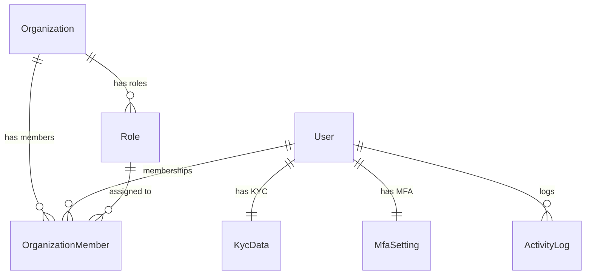

# Auth Service

> **Port:** `3001` | **Framework:** Express | **DB Schema:** `auth`

---

## Overview

Handles user authentication, registration, organization management, role-based access control, KYC verification, MFA settings, and activity logging.

## Database Schema

**Prisma Schema:** `prisma/schema.prisma`



### Models

| Model              | Table                       | Description                                          |
| ------------------ | --------------------------- | ---------------------------------------------------- |
| Organization       | `auth.organizations`        | Multi-tenant organizations                           |
| User               | `auth.users`                | User accounts (email + Google OAuth)                 |
| OrganizationMember | `auth.organization_members` | User ↔ Organization mapping with role                |
| Role               | `auth.roles`                | RBAC roles (Organizer, Manager, Contributor, Client) |
| KycData            | `auth.kyc_data`             | Know Your Customer verification data                 |
| MfaSetting         | `auth.mfa_settings`         | Multi-factor authentication settings                 |
| ActivityLog        | `auth.activity_logs`        | Audit trail of user actions                          |

## Implemented Features

### Authentication (8 modules)

| Feature                             | Endpoint                   | Method |
| ----------------------------------- | -------------------------- | ------ |
| Email/password login                | `POST /auth/login`         | ✅     |
| User registration + auto org create | `POST /auth/register`      | ✅     |
| Google OAuth (login + signup)       | `POST /auth/google`        | ✅     |
| Token refresh                       | `POST /auth/refresh`       | ✅     |
| Logout                              | `POST /auth/logout`        | ✅     |
| Accept invite (set password + role) | `POST /auth/accept-invite` | ✅     |
| Get current user                    | `POST /auth/me`            | ✅     |

### Users — Full CRUD

| Endpoint            | Method |
| ------------------- | ------ |
| `POST /users`       | Create |
| `GET /users`        | List   |
| `GET /users/:id`    | Get    |
| `PUT /users/:id`    | Update |
| `DELETE /users/:id` | Delete |

### Organizations — Full CRUD

| Endpoint                    | Method |
| --------------------------- | ------ |
| `POST /organizations`       | Create |
| `GET /organizations`        | List   |
| `GET /organizations/:id`    | Get    |
| `PUT /organizations/:id`    | Update |
| `DELETE /organizations/:id` | Delete |

### Organization Members — Full CRUD

| Endpoint                           | Method |
| ---------------------------------- | ------ |
| `POST /organization-members`       | Create |
| `GET /organization-members`        | List   |
| `GET /organization-members/:id`    | Get    |
| `PUT /organization-members/:id`    | Update |
| `DELETE /organization-members/:id` | Delete |

### Roles — Full CRUD

| Endpoint            | Method |
| ------------------- | ------ |
| `POST /roles`       | Create |
| `GET /roles`        | List   |
| `GET /roles/:id`    | Get    |
| `PUT /roles/:id`    | Update |
| `DELETE /roles/:id` | Delete |

### KYC Data — Full CRUD

| Endpoint               | Method |
| ---------------------- | ------ |
| `POST /kyc-data`       | Create |
| `GET /kyc-data`        | List   |
| `GET /kyc-data/:id`    | Get    |
| `PUT /kyc-data/:id`    | Update |
| `DELETE /kyc-data/:id` | Delete |

### MFA Settings — Full CRUD

| Endpoint                   | Method |
| -------------------------- | ------ |
| `POST /mfa-settings`       | Create |
| `GET /mfa-settings`        | List   |
| `GET /mfa-settings/:id`    | Get    |
| `PUT /mfa-settings/:id`    | Update |
| `DELETE /mfa-settings/:id` | Delete |

### Activity Logs — Full CRUD

| Endpoint                    | Method |
| --------------------------- | ------ |
| `POST /activity-logs`       | Create |
| `GET /activity-logs`        | List   |
| `GET /activity-logs/:id`    | Get    |
| `PUT /activity-logs/:id`    | Update |
| `DELETE /activity-logs/:id` | Delete |

## Role Hierarchy

| Role            | Scope    | Capabilities                                        |
| --------------- | -------- | --------------------------------------------------- |
| **Organizer**   | Internal | Full system access, creates projects/teams          |
| **Manager**     | Internal | Manages teams and contributors, delegates tasks     |
| **Contributor** | Internal | Works on assigned tasks, limited project visibility |
| **Client**      | External | Portal access only, read-only project view          |

## Running

```bash
npx nx serve auth-service
```

## Testing

```bash
npx nx test auth-service
npx nx e2e auth-service-e2e
```
