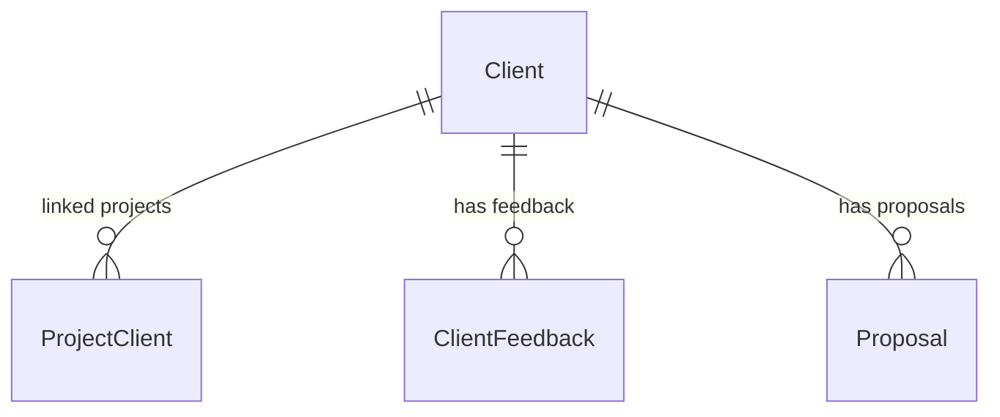

# Client Management Service

> **Port:** `3004` | **Framework:** Express | **DB Schema:** `client`

---

## Overview

Manages client records, client-project associations, client feedback/ratings, and proposals.

## Database Schema

**Prisma Schema:** `prisma/schema.prisma`



### Models

| Model          | Table                    | Key Fields                                                        |
| -------------- | ------------------------ | ----------------------------------------------------------------- |
| Client         | `client.clients`         | organizationId, name, email, company, phone, status, portalAccess |
| ProjectClient  | `client.project_clients` | projectId, clientId                                               |
| ClientFeedback | `client.client_feedback` | clientId, projectId, rating, comment, response                    |
| Proposal       | `client.proposals`       | clientId, title, content, status                                  |

## Implemented Features

### 1. Clients — Full CRUD ✅

| Endpoint              | Description   |
| --------------------- | ------------- |
| `POST /clients`       | Create client |
| `GET /clients`        | List all      |
| `GET /clients/:id`    | Get by ID     |
| `PUT /clients/:id`    | Update        |
| `DELETE /clients/:id` | Delete        |

### 2. Project Clients — Full CRUD ✅

| Endpoint                      | Description            |
| ----------------------------- | ---------------------- |
| `POST /project-clients`       | Link client to project |
| `GET /project-clients`        | List all               |
| `GET /project-clients/:id`    | Get by ID              |
| `PUT /project-clients/:id`    | Update                 |
| `DELETE /project-clients/:id` | Remove link            |

### 3. Client Feedback — Full CRUD ✅

| Endpoint                      | Description     |
| ----------------------------- | --------------- |
| `POST /client-feedback`       | Submit feedback |
| `GET /client-feedback`        | List all        |
| `GET /client-feedback/:id`    | Get by ID       |
| `PUT /client-feedback/:id`    | Update          |
| `DELETE /client-feedback/:id` | Delete          |

### 4. Proposals — Full CRUD ✅

| Endpoint                | Description     |
| ----------------------- | --------------- |
| `POST /proposals`       | Create proposal |
| `GET /proposals`        | List all        |
| `GET /proposals/:id`    | Get by ID       |
| `PUT /proposals/:id`    | Update          |
| `DELETE /proposals/:id` | Delete          |

### Infrastructure

| Endpoint      | Description                 |
| ------------- | --------------------------- |
| `GET /`       | Service info                |
| `GET /health` | Health check with timestamp |

## Running

```bash
npx nx serve client-management
```

## Testing

```bash
npx nx test client-management
npx nx e2e client-management-e2e
```
