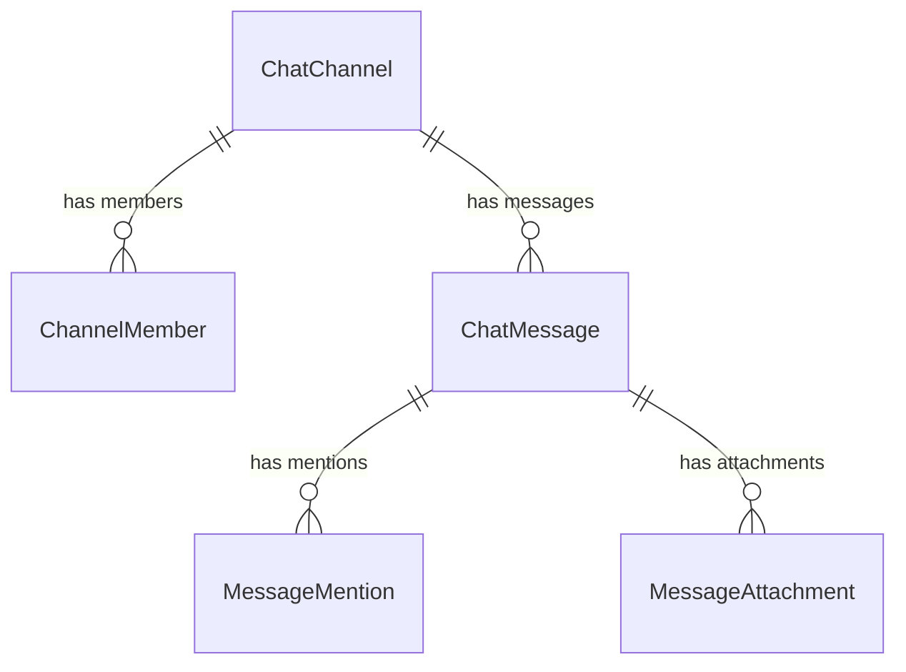

# Communication Service

> **Port:** `3006` | **Framework:** Express | **DB Schema:** `communication`

---

## Overview

Manages real-time chat channels, messages, @mentions, file attachments, and communication audit logs.

## Database Schema

**Prisma Schema:** `prisma/schema.prisma`



### Models

| Model             | Table                               | Key Fields                            |
| ----------------- | ----------------------------------- | ------------------------------------- |
| ChatChannel       | `communication.chat_channels`       | name, type, teamId, projectId         |
| ChannelMember     | `communication.channel_members`     | channelId, userId, role               |
| ChatMessage       | `communication.chat_messages`       | channelId, senderId, content, aiFlags |
| MessageMention    | `communication.message_mentions`    | messageId, userId                     |
| MessageAttachment | `communication.message_attachments` | messageId, url, fileType              |
| CommunicationLog  | `communication.communication_logs`  | type, details (JSON)                  |

## Implemented Features

### 1. Chat Channels — Full CRUD ✅

| Endpoint                    | Description    |
| --------------------------- | -------------- |
| `POST /chat-channels`       | Create channel |
| `GET /chat-channels`        | List all       |
| `GET /chat-channels/:id`    | Get by ID      |
| `PUT /chat-channels/:id`    | Update         |
| `DELETE /chat-channels/:id` | Delete         |

### 2. Channel Members — Full CRUD ✅

| Endpoint                      | Description   |
| ----------------------------- | ------------- |
| `POST /channel-members`       | Add member    |
| `GET /channel-members`        | List all      |
| `GET /channel-members/:id`    | Get by ID     |
| `PUT /channel-members/:id`    | Update role   |
| `DELETE /channel-members/:id` | Remove member |

### 3. Chat Messages — Full CRUD ✅

| Endpoint                    | Description    |
| --------------------------- | -------------- |
| `POST /chat-messages`       | Send message   |
| `GET /chat-messages`        | List all       |
| `GET /chat-messages/:id`    | Get by ID      |
| `PUT /chat-messages/:id`    | Edit message   |
| `DELETE /chat-messages/:id` | Delete message |

### 4. Message Mentions — Full CRUD ✅

| Endpoint                       | Description    |
| ------------------------------ | -------------- |
| `POST /message-mentions`       | Create mention |
| `GET /message-mentions`        | List all       |
| `GET /message-mentions/:id`    | Get by ID      |
| `PUT /message-mentions/:id`    | Update         |
| `DELETE /message-mentions/:id` | Delete         |

### 5. Message Attachments — Full CRUD ✅

| Endpoint                          | Description       |
| --------------------------------- | ----------------- |
| `POST /message-attachments`       | Upload attachment |
| `GET /message-attachments`        | List all          |
| `GET /message-attachments/:id`    | Get by ID         |
| `PUT /message-attachments/:id`    | Update            |
| `DELETE /message-attachments/:id` | Delete            |

### 6. Communication Logs — Full CRUD ✅

| Endpoint                         | Description |
| -------------------------------- | ----------- |
| `POST /communication-logs`       | Create log  |
| `GET /communication-logs`        | List all    |
| `GET /communication-logs/:id`    | Get by ID   |
| `PUT /communication-logs/:id`    | Update      |
| `DELETE /communication-logs/:id` | Delete      |

### Infrastructure

| Endpoint      | Description                 |
| ------------- | --------------------------- |
| `GET /`       | Service info                |
| `GET /health` | Health check with timestamp |

## Running

```bash
npx nx serve communication
```

## Testing

```bash
npx nx test communication
npx nx e2e communication-e2e
```
