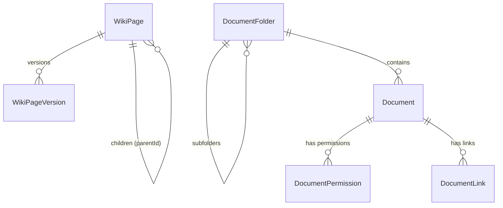

# Knowledge Hub Service

> **Port:** `3005` | **Framework:** Express | **DB Schema:** `knowledge`

---

## Overview

Manages wiki pages (with version history and hierarchy), document storage, folder structure, document permissions, and entity linking.

## Database Schema

**Prisma Schema:** `prisma/schema.prisma`



### Models

| Model              | Table                            | Key Fields                                   |
| ------------------ | -------------------------------- | -------------------------------------------- |
| WikiPage           | `knowledge.wiki_pages`           | title, content, parentId (hierarchy)         |
| WikiPageVersion    | `knowledge.wiki_page_versions`   | wikiPageId, content, version                 |
| DocumentFolder     | `knowledge.document_folders`     | organizationId, name, parentId (hierarchy)   |
| Document           | `knowledge.documents`            | organizationId, folderId, name, url, version |
| DocumentPermission | `knowledge.document_permissions` | documentId, userId, roleId, permission       |
| DocumentLink       | `knowledge.document_links`       | documentId, entityType, entityId             |

## Implemented Features

### 1. Wiki Pages — Full CRUD ✅

| Endpoint                 | Description |
| ------------------------ | ----------- |
| `POST /wiki-pages`       | Create page |
| `GET /wiki-pages`        | List all    |
| `GET /wiki-pages/:id`    | Get by ID   |
| `PUT /wiki-pages/:id`    | Update      |
| `DELETE /wiki-pages/:id` | Delete      |

### 2. Wiki Page Versions — Full CRUD ✅

| Endpoint                         | Description    |
| -------------------------------- | -------------- |
| `POST /wiki-page-versions`       | Create version |
| `GET /wiki-page-versions`        | List all       |
| `GET /wiki-page-versions/:id`    | Get by ID      |
| `PUT /wiki-page-versions/:id`    | Update         |
| `DELETE /wiki-page-versions/:id` | Delete         |

### 3. Document Folders — Full CRUD ✅

| Endpoint                       | Description   |
| ------------------------------ | ------------- |
| `POST /document-folders`       | Create folder |
| `GET /document-folders`        | List all      |
| `GET /document-folders/:id`    | Get by ID     |
| `PUT /document-folders/:id`    | Update        |
| `DELETE /document-folders/:id` | Delete        |

### 4. Documents — Full CRUD ✅

| Endpoint                | Description     |
| ----------------------- | --------------- |
| `POST /documents`       | Create document |
| `GET /documents`        | List all        |
| `GET /documents/:id`    | Get by ID       |
| `PUT /documents/:id`    | Update          |
| `DELETE /documents/:id` | Delete          |

### 5. Document Permissions — Full CRUD ✅

| Endpoint                           | Description      |
| ---------------------------------- | ---------------- |
| `POST /document-permissions`       | Grant permission |
| `GET /document-permissions`        | List all         |
| `GET /document-permissions/:id`    | Get by ID        |
| `PUT /document-permissions/:id`    | Update           |
| `DELETE /document-permissions/:id` | Revoke           |

### 6. Document Links — Full CRUD ✅

| Endpoint                     | Description |
| ---------------------------- | ----------- |
| `POST /document-links`       | Create link |
| `GET /document-links`        | List all    |
| `GET /document-links/:id`    | Get by ID   |
| `PUT /document-links/:id`    | Update      |
| `DELETE /document-links/:id` | Delete      |

### Infrastructure

| Endpoint      | Description                 |
| ------------- | --------------------------- |
| `GET /`       | Service info                |
| `GET /health` | Health check with timestamp |

## Running

```bash
npx nx serve knowledge-hub
```

## Testing

```bash
npx nx test knowledge-hub
npx nx e2e knowledge-hub-e2e
```
