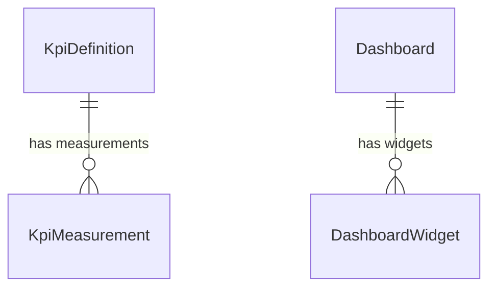

# Monitoring & Reporting Service

> **Port:** `3007` | **Framework:** Express | **DB Schema:** `monitoring`

---

## Overview

Manages KPI definitions and measurements, report generation, member performance tracking, AI conversation logs, automation rules/logs, and customizable dashboards with widgets.

## Database Schema

**Prisma Schema:** `prisma/schema.prisma`



### Models

| Model             | Table                           | Key Fields                         |
| ----------------- | ------------------------------- | ---------------------------------- |
| KpiDefinition     | `monitoring.kpi_definitions`    | name, formula                      |
| KpiMeasurement    | `monitoring.kpi_measurements`   | kpiId, value, measuredAt           |
| ReportTemplate    | `monitoring.report_templates`   | name, config (JSON)                |
| GeneratedReport   | `monitoring.generated_reports`  | templateId, url, format            |
| MemberPerformance | `monitoring.member_performance` | userId, metric, value, period      |
| AiConversation    | `monitoring.ai_conversations`   | userId, context (JSON), tokensUsed |
| AutomationRule    | `monitoring.automation_rules`   | name, trigger, actions, isActive   |
| AutomationLog     | `monitoring.automation_logs`    | ruleId, status, details            |
| Dashboard         | `monitoring.dashboards`         | userId, name, layout (JSON)        |
| DashboardWidget   | `monitoring.dashboard_widgets`  | dashboardId, type, config (JSON)   |

## Implemented Features

### 1. KPI Definitions — Full CRUD ✅

| Endpoint                      | Description |
| ----------------------------- | ----------- |
| `POST /kpi-definitions`       | Create KPI  |
| `GET /kpi-definitions`        | List all    |
| `GET /kpi-definitions/:id`    | Get by ID   |
| `PUT /kpi-definitions/:id`    | Update      |
| `DELETE /kpi-definitions/:id` | Delete      |

### 2. KPI Measurements — Full CRUD ✅

| Endpoint                       | Description        |
| ------------------------------ | ------------------ |
| `POST /kpi-measurements`       | Record measurement |
| `GET /kpi-measurements`        | List all           |
| `GET /kpi-measurements/:id`    | Get by ID          |
| `PUT /kpi-measurements/:id`    | Update             |
| `DELETE /kpi-measurements/:id` | Delete             |

### 3. Report Templates — Full CRUD ✅

| Endpoint                       | Description     |
| ------------------------------ | --------------- |
| `POST /report-templates`       | Create template |
| `GET /report-templates`        | List all        |
| `GET /report-templates/:id`    | Get by ID       |
| `PUT /report-templates/:id`    | Update          |
| `DELETE /report-templates/:id` | Delete          |

### 4. Generated Reports — Full CRUD ✅

| Endpoint                        | Description     |
| ------------------------------- | --------------- |
| `POST /generated-reports`       | Generate report |
| `GET /generated-reports`        | List all        |
| `GET /generated-reports/:id`    | Get by ID       |
| `PUT /generated-reports/:id`    | Update          |
| `DELETE /generated-reports/:id` | Delete          |

### 5. Member Performance — Full CRUD ✅

| Endpoint                         | Description   |
| -------------------------------- | ------------- |
| `POST /member-performance`       | Record metric |
| `GET /member-performance`        | List all      |
| `GET /member-performance/:id`    | Get by ID     |
| `PUT /member-performance/:id`    | Update        |
| `DELETE /member-performance/:id` | Delete        |

### 6. AI Conversations — Full CRUD ✅

| Endpoint                       | Description |
| ------------------------------ | ----------- |
| `POST /ai-conversations`       | Create      |
| `GET /ai-conversations`        | List all    |
| `GET /ai-conversations/:id`    | Get by ID   |
| `PUT /ai-conversations/:id`    | Update      |
| `DELETE /ai-conversations/:id` | Delete      |

### 7. Automation Rules — Full CRUD ✅

| Endpoint                       | Description |
| ------------------------------ | ----------- |
| `POST /automation-rules`       | Create rule |
| `GET /automation-rules`        | List all    |
| `GET /automation-rules/:id`    | Get by ID   |
| `PUT /automation-rules/:id`    | Update      |
| `DELETE /automation-rules/:id` | Delete      |

### 8. Automation Logs — Full CRUD ✅

| Endpoint                      | Description |
| ----------------------------- | ----------- |
| `POST /automation-logs`       | Create log  |
| `GET /automation-logs`        | List all    |
| `GET /automation-logs/:id`    | Get by ID   |
| `PUT /automation-logs/:id`    | Update      |
| `DELETE /automation-logs/:id` | Delete      |

### 9. Dashboards — Full CRUD ✅

| Endpoint                 | Description      |
| ------------------------ | ---------------- |
| `POST /dashboards`       | Create dashboard |
| `GET /dashboards`        | List all         |
| `GET /dashboards/:id`    | Get by ID        |
| `PUT /dashboards/:id`    | Update           |
| `DELETE /dashboards/:id` | Delete           |

### 10. Dashboard Widgets — Full CRUD ✅

| Endpoint                        | Description   |
| ------------------------------- | ------------- |
| `POST /dashboard-widgets`       | Create widget |
| `GET /dashboard-widgets`        | List all      |
| `GET /dashboard-widgets/:id`    | Get by ID     |
| `PUT /dashboard-widgets/:id`    | Update        |
| `DELETE /dashboard-widgets/:id` | Delete        |

## Running

```bash
npx nx serve monitoring-reporting
```

## Testing

```bash
npx nx test monitoring-reporting
npx nx e2e monitoring-reporting-e2e
```
