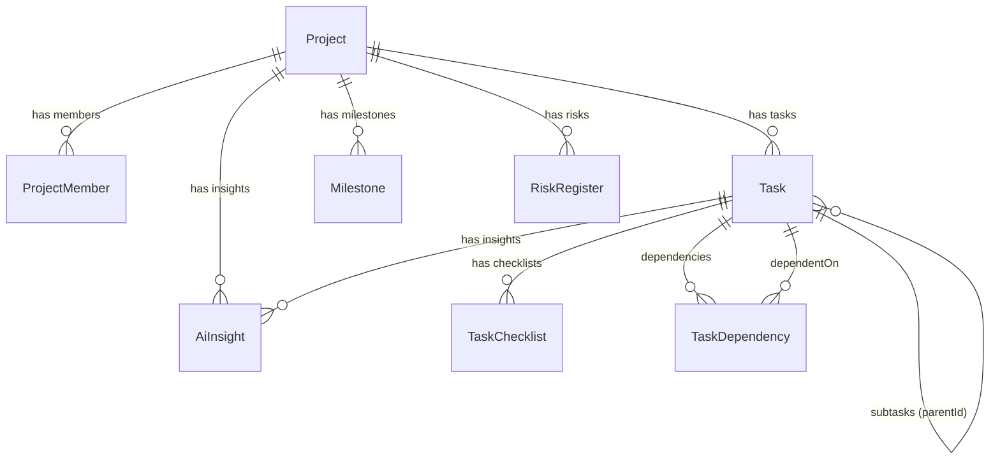

# Project Management Service

> **Port:** `3003` | **Framework:** Express | **DB Schema:** `project`

---

## Overview

Manages projects, tasks (with subtask hierarchy), milestones, risk registers, project members, task checklists, task dependencies, and AI-powered insights.

## Database Schema

**Prisma Schema:** `prisma/schema.prisma`



### Models

| Model          | Table                       | Key Fields                                                |
| -------------- | --------------------------- | --------------------------------------------------------- |
| Project        | `project.projects`          | organizationId, name, status, budget, progress, managerId |
| ProjectMember  | `project.project_members`   | projectId, userId, role                                   |
| Task           | `project.tasks`             | projectId, parentId, assigneeId, title, status, priority  |
| TaskChecklist  | `project.task_checklists`   | taskId, item, isCompleted                                 |
| TaskDependency | `project.task_dependencies` | taskId, dependsOnId, type                                 |
| Milestone      | `project.milestones`        | projectId, title, dueDate, status, completed              |
| RiskRegister   | `project.risk_register`     | projectId, description, probability, impact, status       |
| AiInsight      | `project.ai_insights`       | projectId, taskId, content, confidence, actionable        |

## Implemented Features

### 1. Projects — Full CRUD ✅

| Endpoint               | Description                                       |
| ---------------------- | ------------------------------------------------- |
| `POST /projects`       | Create project                                    |
| `GET /projects`        | List all (filter: status, search, organizationId) |
| `GET /projects/:id`    | Get by ID                                         |
| `PUT /projects/:id`    | Update                                            |
| `DELETE /projects/:id` | Delete                                            |

### 2. Tasks — Full CRUD ✅

| Endpoint            | Description                  |
| ------------------- | ---------------------------- |
| `POST /tasks`       | Create task                  |
| `GET /tasks`        | List all (filter: projectId) |
| `GET /tasks/:id`    | Get by ID                    |
| `PUT /tasks/:id`    | Update                       |
| `DELETE /tasks/:id` | Delete                       |

**Extra fields:** `parentId` (subtasks), `creatorId`, `estimatedHours`, `actualHours`, `aiSuggestions`

### 3. Milestones — Full CRUD ✅

| Endpoint                 | Description                                |
| ------------------------ | ------------------------------------------ |
| `POST /milestones`       | Create (supports `name` → `title` mapping) |
| `GET /milestones`        | List all (filter: projectId)               |
| `GET /milestones/:id`    | Get by ID                                  |
| `PUT /milestones/:id`    | Update                                     |
| `DELETE /milestones/:id` | Delete                                     |

### 4. Risk Register — Full CRUD ✅

| Endpoint                    | Description |
| --------------------------- | ----------- |
| `POST /risk-register`       | Create risk |
| `GET /risk-register`        | List all    |
| `GET /risk-register/:id`    | Get by ID   |
| `PUT /risk-register/:id`    | Update      |
| `DELETE /risk-register/:id` | Delete      |

### 5. Project Members — Full CRUD ✅

| Endpoint                      | Description   |
| ----------------------------- | ------------- |
| `POST /project-members`       | Add member    |
| `GET /project-members`        | List all      |
| `GET /project-members/:id`    | Get by ID     |
| `PUT /project-members/:id`    | Update role   |
| `DELETE /project-members/:id` | Remove member |

### 6. Task Checklists — Full CRUD ✅

| Endpoint                      | Description     |
| ----------------------------- | --------------- |
| `POST /task-checklists`       | Create item     |
| `GET /task-checklists`        | List all        |
| `GET /task-checklists/:id`    | Get by ID       |
| `PUT /task-checklists/:id`    | Update (toggle) |
| `DELETE /task-checklists/:id` | Delete          |

### 7. Task Dependencies — Full CRUD ✅

| Endpoint                        | Description       |
| ------------------------------- | ----------------- |
| `POST /task-dependencies`       | Create dependency |
| `GET /task-dependencies`        | List all          |
| `GET /task-dependencies/:id`    | Get by ID         |
| `PUT /task-dependencies/:id`    | Update            |
| `DELETE /task-dependencies/:id` | Delete            |

### 8. AI Insights — Create & Read ⚠️

| Endpoint                      | Description        |
| ----------------------------- | ------------------ |
| `POST /ai-insights`           | Create insight     |
| `GET /ai-insights`            | List all           |
| `GET /ai-insights/:id`        | Get by ID          |
| ~~`PUT /ai-insights/:id`~~    | ❌ Not implemented |
| ~~`DELETE /ai-insights/:id`~~ | ❌ Not implemented |

### Infrastructure

| Endpoint      | Description                 |
| ------------- | --------------------------- |
| `GET /`       | Service info                |
| `GET /health` | Health check with timestamp |

## Validation

All routes use **Zod** schemas via shared `validateRequest()` middleware. Invalid requests return `400` with detailed error messages.

## Running

```bash
npx nx serve project-management
```

## Testing

```bash
npx nx test project-management
npx nx e2e project-management-e2e
```
