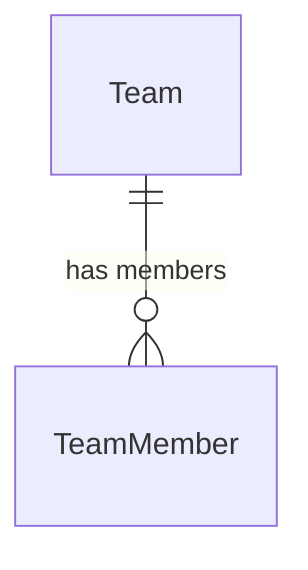

# Workforce Management Service

> **Port:** `3002` | **Framework:** Express | **DB Schema:** `workforce`

---

## Overview

Manages teams, team members, user skills/proficiency, and user availability scheduling.

## Database Schema

**Prisma Schema:** `prisma/schema.prisma`



### Models

| Model            | Table                         | Key Fields                                   |
| ---------------- | ----------------------------- | -------------------------------------------- |
| Team             | `workforce.teams`             | organizationId, name, description, managerId |
| TeamMember       | `workforce.team_members`      | teamId, userId, role                         |
| UserSkill        | `workforce.user_skills`       | userId, skillName, proficiency               |
| UserAvailability | `workforce.user_availability` | userId, date, hoursAvailable                 |

## Implemented Features

### 1. Teams — Full CRUD ✅

| Endpoint            | Description |
| ------------------- | ----------- |
| `POST /teams`       | Create team |
| `GET /teams`        | List all    |
| `GET /teams/:id`    | Get by ID   |
| `PUT /teams/:id`    | Update      |
| `DELETE /teams/:id` | Delete      |

### 2. Team Members — Full CRUD ✅

| Endpoint                   | Description   |
| -------------------------- | ------------- |
| `POST /team-members`       | Add member    |
| `GET /team-members`        | List all      |
| `GET /team-members/:id`    | Get by ID     |
| `PUT /team-members/:id`    | Update role   |
| `DELETE /team-members/:id` | Remove member |

### 3. User Skills — Full CRUD ✅

| Endpoint                  | Description |
| ------------------------- | ----------- |
| `POST /user-skills`       | Add skill   |
| `GET /user-skills`        | List all    |
| `GET /user-skills/:id`    | Get by ID   |
| `PUT /user-skills/:id`    | Update      |
| `DELETE /user-skills/:id` | Delete      |

### 4. User Availability — Full CRUD ✅

| Endpoint                        | Description      |
| ------------------------------- | ---------------- |
| `POST /user-availability`       | Set availability |
| `GET /user-availability`        | List all         |
| `GET /user-availability/:id`    | Get by ID        |
| `PUT /user-availability/:id`    | Update           |
| `DELETE /user-availability/:id` | Delete           |

### Infrastructure

| Endpoint      | Description                 |
| ------------- | --------------------------- |
| `GET /`       | Service info                |
| `GET /health` | Health check with timestamp |

## Running

```bash
npx nx serve workforce-management
```

## Testing

```bash
npx nx test workforce-management
npx nx e2e workforce-management-e2e
```
