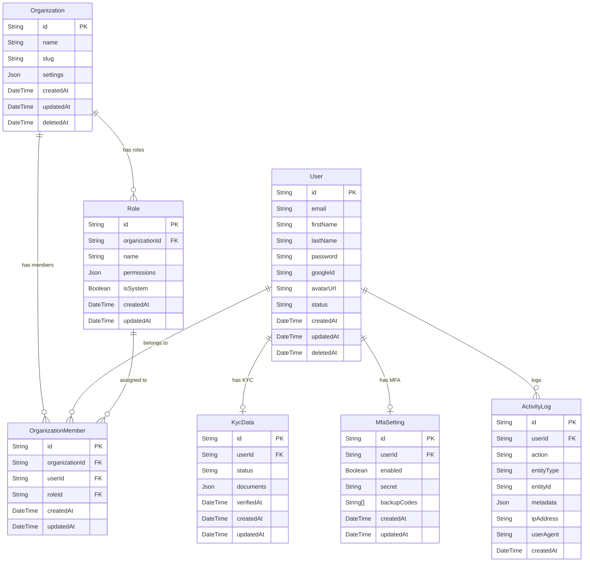

# Auth Service ERD

```mermaid
erDiagram
    Organization ||--o{ OrganizationMember : "has members"
    Organization ||--o{ Role : "has roles"
    User ||--o{ OrganizationMember : "belongs to"
    User ||--o| KycData : "has KYC"
    User ||--o| MfaSetting : "has MFA"
    User ||--o{ ActivityLog : "logs"
    Role ||--o{ OrganizationMember : "assigned to"

    Organization {
        String id PK
        String name
        String slug
        Json settings
        DateTime createdAt
        DateTime updatedAt
        DateTime deletedAt
    }
    User {
        String id PK
        String email
        String firstName
        String lastName
        String password
        String googleId
        String avatarUrl
        String status
        DateTime createdAt
        DateTime updatedAt
        DateTime deletedAt
    }
    OrganizationMember {
        String id PK
        String organizationId FK
        String userId FK
        String roleId FK
        DateTime createdAt
        DateTime updatedAt
    }
    Role {
        String id PK
        String organizationId FK
        String name
        Json permissions
        Boolean isSystem
        DateTime createdAt
        DateTime updatedAt
    }
    KycData {
        String id PK
        String userId FK
        String status
        Json documents
        DateTime verifiedAt
        DateTime createdAt
        DateTime updatedAt
    }
    MfaSetting {
        String id PK
        String userId FK
        Boolean enabled
        String secret
        String[] backupCodes
        DateTime createdAt
        DateTime updatedAt
    }
    ActivityLog {
        String id PK
        String userId FK
        String action
        String entityType
        String entityId
        Json metadata
        String ipAddress
        String userAgent
        DateTime createdAt
    }
```
