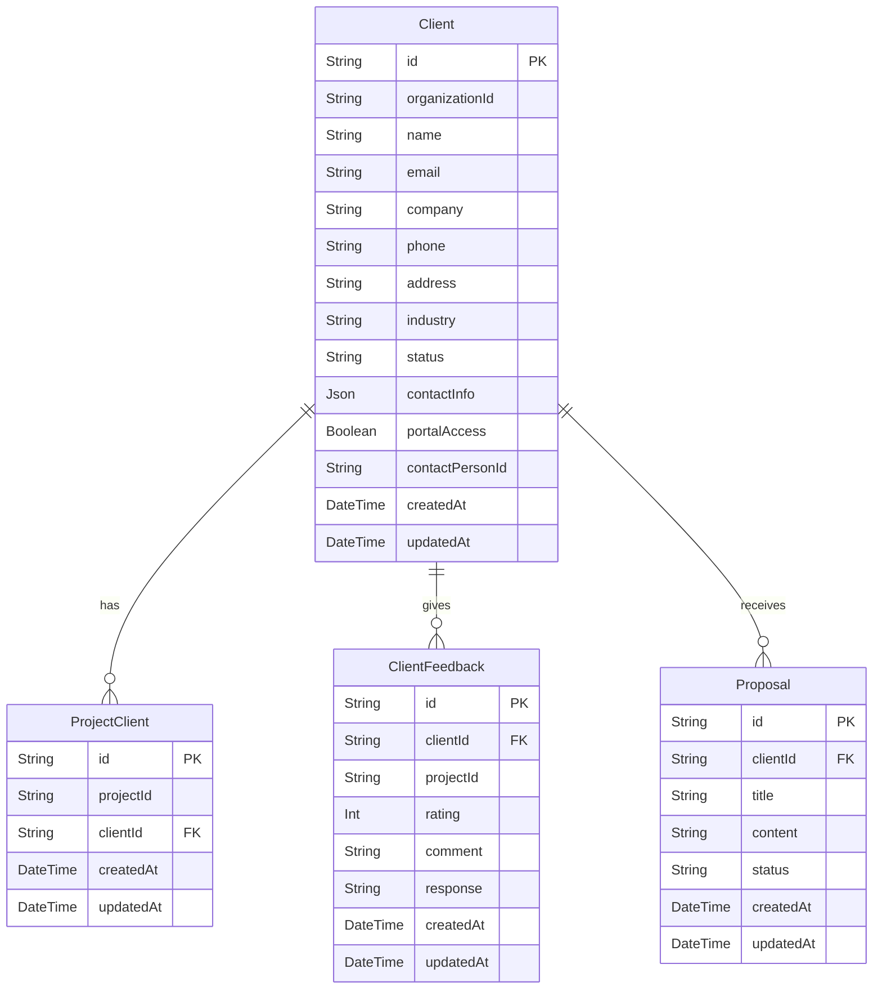

# Client Management ERD

```mermaid
erDiagram
    Client ||--o{ ProjectClient : has
    Client ||--o{ ClientFeedback : gives
    Client ||--o{ Proposal : receives

    Client {
        String id PK
        String organizationId
        String name
        String email
        String company
        String phone
        String address
        String industry
        String status
        Json contactInfo
        Boolean portalAccess
        String contactPersonId
        DateTime createdAt
        DateTime updatedAt
    }
    ProjectClient {
        String id PK
        String projectId
        String clientId FK
        DateTime createdAt
        DateTime updatedAt
    }
    ClientFeedback {
        String id PK
        String clientId FK
        String projectId
        Int rating
        String comment
        String response
        DateTime createdAt
        DateTime updatedAt
    }
    Proposal {
        String id PK
        String clientId FK
        String title
        String content
        String status
        DateTime createdAt
        DateTime updatedAt
    }
```
