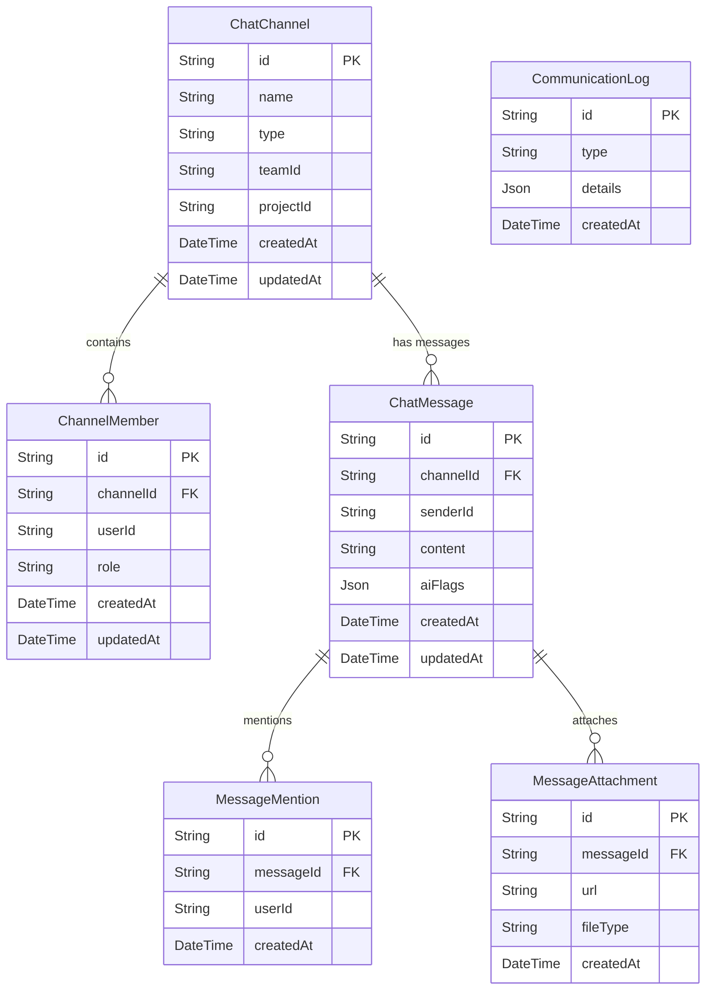

# Communication ERD

```mermaid
erDiagram
    ChatChannel ||--o{ ChannelMember : contains
    ChatChannel ||--o{ ChatMessage : "has messages"
    ChatMessage ||--o{ MessageMention : mentions
    ChatMessage ||--o{ MessageAttachment : attaches

    ChatChannel {
        String id PK
        String name
        String type
        String teamId
        String projectId
        DateTime createdAt
        DateTime updatedAt
    }
    ChannelMember {
        String id PK
        String channelId FK
        String userId
        String role
        DateTime createdAt
        DateTime updatedAt
    }
    ChatMessage {
        String id PK
        String channelId FK
        String senderId
        String content
        Json aiFlags
        DateTime createdAt
        DateTime updatedAt
    }
    MessageMention {
        String id PK
        String messageId FK
        String userId
        DateTime createdAt
    }
    MessageAttachment {
        String id PK
        String messageId FK
        String url
        String fileType
        DateTime createdAt
    }
    CommunicationLog {
        String id PK
        String type
        Json details
        DateTime createdAt
    }
```
