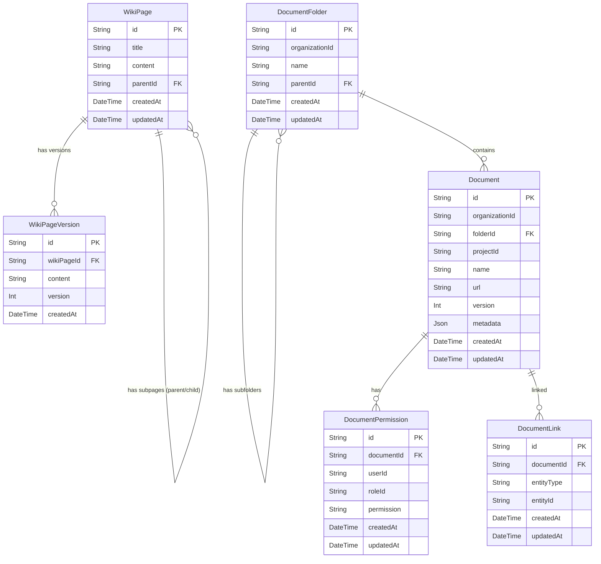

# Knowledge Hub ERD

```mermaid
erDiagram
    WikiPage ||--o{ WikiPage : "has subpages (parent/child)"
    WikiPage ||--o{ WikiPageVersion : "has versions"
    DocumentFolder ||--o{ DocumentFolder : "has subfolders"
    DocumentFolder ||--o{ Document : contains
    Document ||--o{ DocumentPermission : has
    Document ||--o{ DocumentLink : linked

    WikiPage {
        String id PK
        String title
        String content
        String parentId FK
        DateTime createdAt
        DateTime updatedAt
    }
    WikiPageVersion {
        String id PK
        String wikiPageId FK
        String content
        Int version
        DateTime createdAt
    }
    DocumentFolder {
        String id PK
        String organizationId
        String name
        String parentId FK
        DateTime createdAt
        DateTime updatedAt
    }
    Document {
        String id PK
        String organizationId
        String folderId FK
        String projectId
        String name
        String url
        Int version
        Json metadata
        DateTime createdAt
        DateTime updatedAt
    }
    DocumentPermission {
        String id PK
        String documentId FK
        String userId
        String roleId
        String permission
        DateTime createdAt
        DateTime updatedAt
    }
    DocumentLink {
        String id PK
        String documentId FK
        String entityType
        String entityId
        DateTime createdAt
        DateTime updatedAt
    }
```
