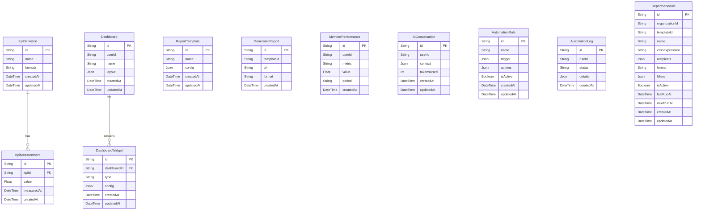

# Monitoring & Reporting ERD

```mermaid
erDiagram
    KpiDefinition ||--o{ KpiMeasurement : has
    Dashboard ||--o{ DashboardWidget : contains

    KpiDefinition {
        String id PK
        String name
        String formula
        DateTime createdAt
        DateTime updatedAt
    }
    KpiMeasurement {
        String id PK
        String kpiId FK
        Float value
        DateTime measuredAt
        DateTime createdAt
    }
    ReportTemplate {
        String id PK
        String name
        Json config
        DateTime createdAt
        DateTime updatedAt
    }
    GeneratedReport {
        String id PK
        String templateId
        String url
        String format
        DateTime createdAt
    }
    MemberPerformance {
        String id PK
        String userId
        String metric
        Float value
        String period
        DateTime createdAt
    }
    AiConversation {
        String id PK
        String userId
        Json context
        Int tokensUsed
        DateTime createdAt
        DateTime updatedAt
    }
    AutomationRule {
        String id PK
        String name
        Json trigger
        Json actions
        Boolean isActive
        DateTime createdAt
        DateTime updatedAt
    }
    AutomationLog {
        String id PK
        String ruleId
        String status
        Json details
        DateTime createdAt
    }
    Dashboard {
        String id PK
        String userId
        String name
        Json layout
        DateTime createdAt
        DateTime updatedAt
    }
    DashboardWidget {
        String id PK
        String dashboardId FK
        String type
        Json config
        DateTime createdAt
        DateTime updatedAt
    }
    ReportSchedule {
        String id PK
        String organizationId
        String templateId
        String name
        String cronExpression
        Json recipients
        String format
        Json filters
        Boolean isActive
        DateTime lastRunAt
        DateTime nextRunAt
        DateTime createdAt
        DateTime updatedAt
    }
```
