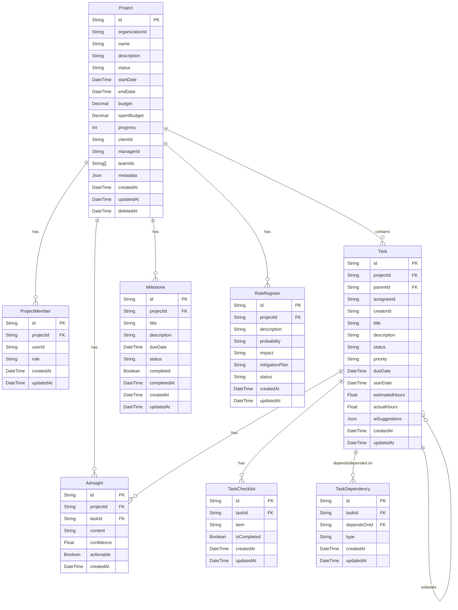

# Project Management ERD

```mermaid
erDiagram
    Project ||--o{ ProjectMember : has
    Project ||--o{ Task : contains
    Project ||--o{ Milestone : has
    Project ||--o{ RiskRegister : has
    Project ||--o{ AiInsight : has
    Task ||--o{ Task : subtasks
    Task ||--o{ TaskChecklist : has
    Task ||--o{ TaskDependency : "depends/depended on"
    Task ||--o{ AiInsight : has

    Project {
        String id PK
        String organizationId
        String name
        String description
        String status
        DateTime startDate
        DateTime endDate
        Decimal budget
        Decimal spentBudget
        Int progress
        String clientId
        String managerId
        String[] teamIds
        Json metadata
        DateTime createdAt
        DateTime updatedAt
        DateTime deletedAt
    }
    ProjectMember {
        String id PK
        String projectId FK
        String userId
        String role
        DateTime createdAt
        DateTime updatedAt
    }
    Task {
        String id PK
        String projectId FK
        String parentId FK
        String assigneeId
        String creatorId
        String title
        String description
        String status
        String priority
        DateTime dueDate
        DateTime startDate
        Float estimatedHours
        Float actualHours
        Json aiSuggestions
        DateTime createdAt
        DateTime updatedAt
    }
    TaskChecklist {
        String id PK
        String taskId FK
        String item
        Boolean isCompleted
        DateTime createdAt
        DateTime updatedAt
    }
    TaskDependency {
        String id PK
        String taskId FK
        String dependsOnId FK
        String type
        DateTime createdAt
        DateTime updatedAt
    }
    Milestone {
        String id PK
        String projectId FK
        String title
        String description
        DateTime dueDate
        String status
        Boolean completed
        DateTime completedAt
        DateTime createdAt
        DateTime updatedAt
    }
    RiskRegister {
        String id PK
        String projectId FK
        String description
        String probability
        String impact
        String mitigationPlan
        String status
        DateTime createdAt
        DateTime updatedAt
    }
    AiInsight {
        String id PK
        String projectId FK
        String taskId FK
        String content
        Float confidence
        Boolean actionable
        DateTime createdAt
    }
```
