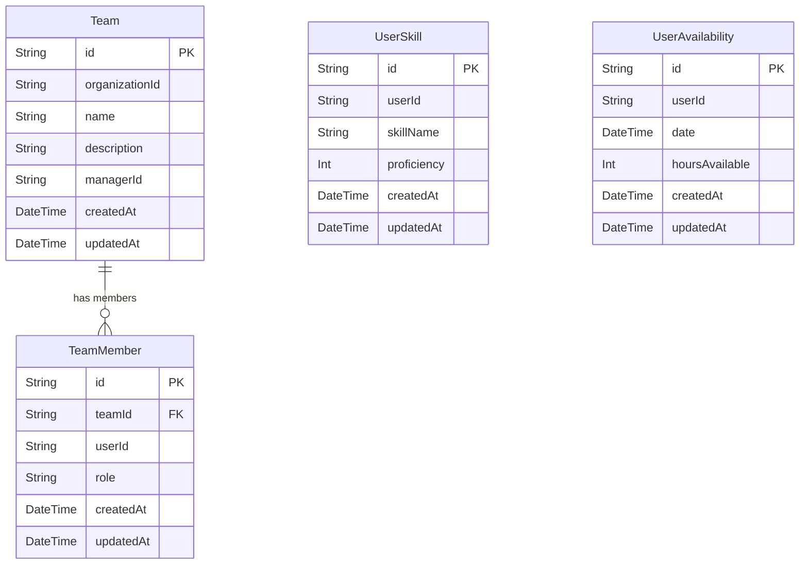

# Workforce Management ERD

```mermaid
erDiagram
    Team ||--o{ TeamMember : "has members"

    Team {
        String id PK
        String organizationId
        String name
        String description
        String managerId
        DateTime createdAt
        DateTime updatedAt
    }
    TeamMember {
        String id PK
        String teamId FK
        String userId
        String role
        DateTime createdAt
        DateTime updatedAt
    }
    UserSkill {
        String id PK
        String userId
        String skillName
        Int proficiency
        DateTime createdAt
        DateTime updatedAt
    }
    UserAvailability {
        String id PK
        String userId
        DateTime date
        Int hoursAvailable
        DateTime createdAt
        DateTime updatedAt
    }
```
